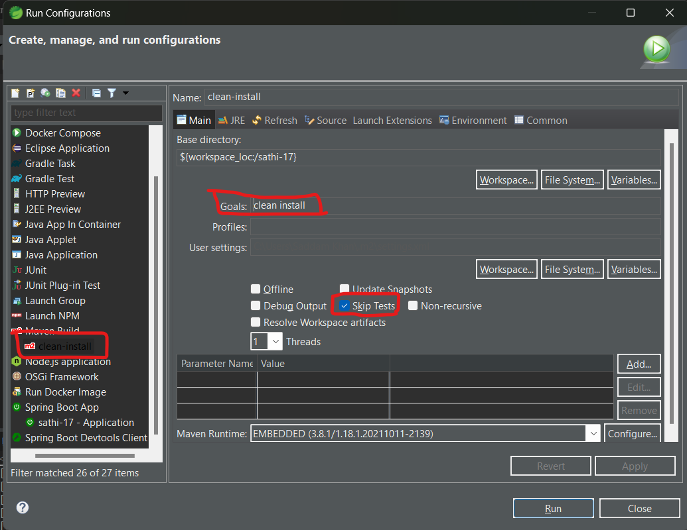
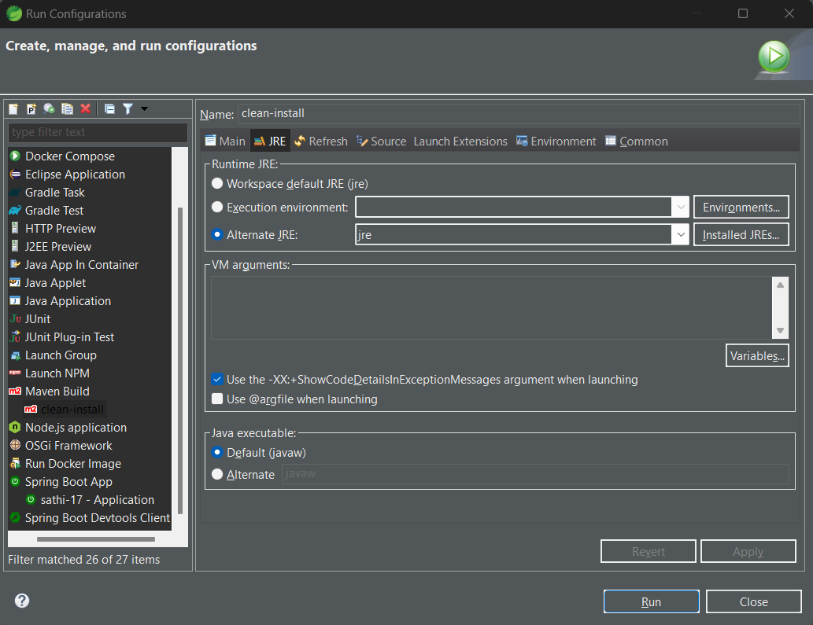
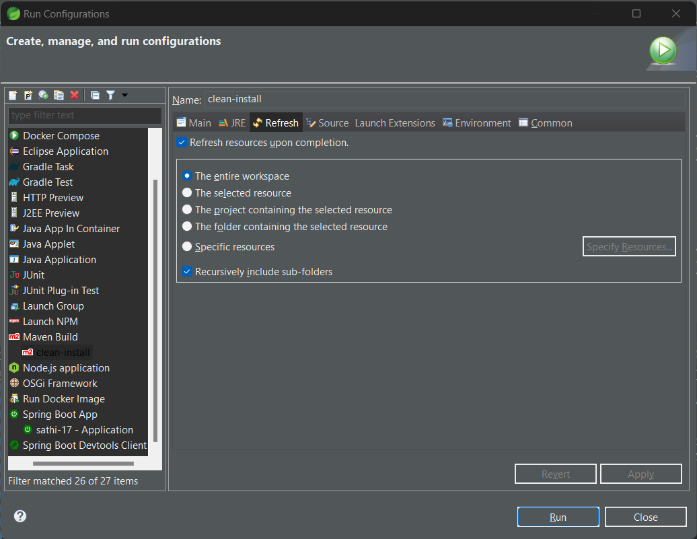
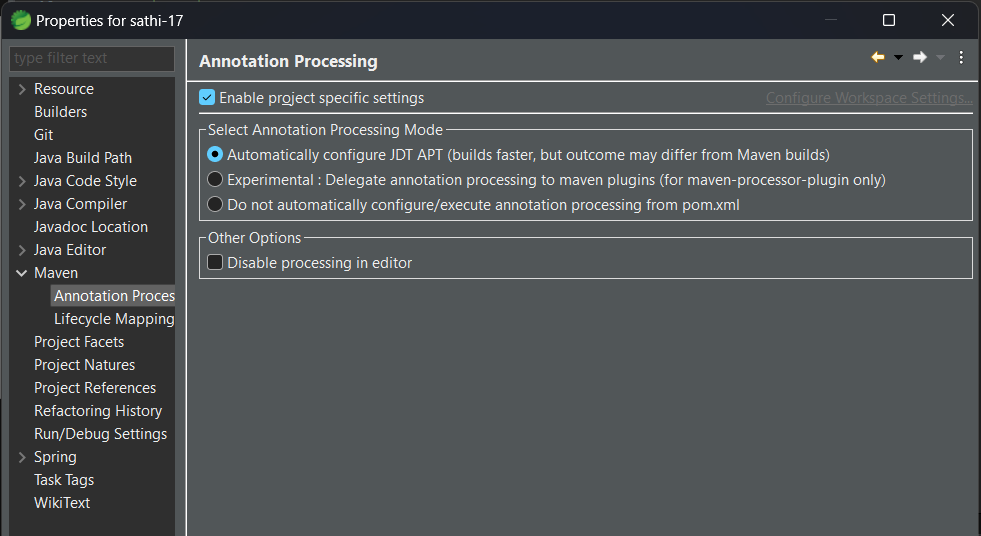

# About sathi-17
This repo is built on jdk-17, springboot-3.2.1 and mysql-8. It is an springboot application not a J2EE application.

# Steps to setup maven clean-install build

# Facing issue with getters and setter using lombok
Enable Annotation Processing go to  
Build Path -> Configure Build Path -> Maven -> Annotation Processing

# Facing issue with time zone 
Run below query  
SET TIME_ZONE='+05:30';
